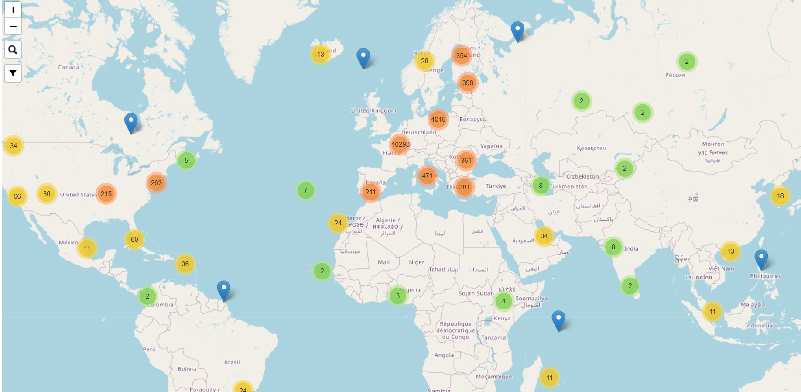
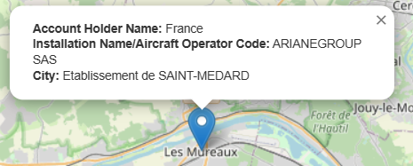
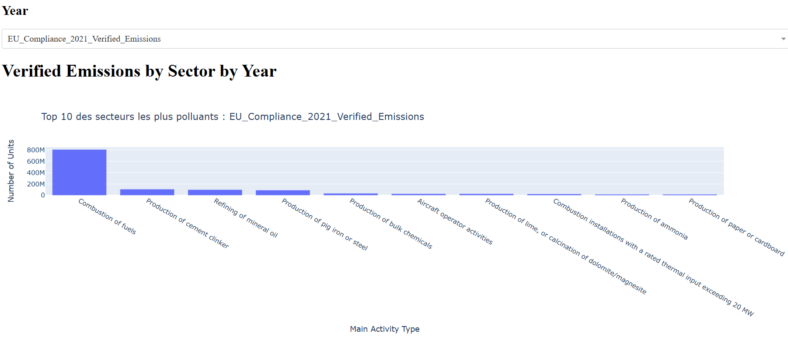

# Europa_Scraping - English version

La version Francaise [ici](https://github.com/MunznerLouis/Europa_Scraping)

## About the Project

Welcome to the repository dedicated to our Science Po project for the second semester of 2023. This repository is intended to gather our code and facilitate collaboration between us.

Our project consists of web scraping the website https://ec.europa.eu/clima/ets/welcome.do?languageCode=fr in order to collect specific data.

On our side, the project is finished, but feel free to copy it or draw inspiration from it for your own projects.


### Used languages

Python 3.10.5 - Scrapy Project  


<!-- GETTING STARTED -->
## Getting Started

### Prerequisites

data extraction:

- Scrapy 2.7.1   
Other libraries such as **logging** and **datetime** should be integrated in the standard library of your Python version.

dashboards:

- numpy 1.24.1 for data manipulation
- pandas 1.5.3 for data manipulation
- plotly 5.13.1 for creating graphs
- dash 2.9.1 for developing web applications for data visualization
- geopy 2.3.0 to get latitude and longitude coordinates for addresses
- folium 0.14.0 to create an interactive map centered on the mean Latitude and Longitude of the holding accounts

### Installation

1. Clone the project repository: ```git clone https://github.com/MunznerLouis/Europa_Scraping```

2. Navigate to the project directory: ```cd "your-project"```

3. Install dependencies: ```pip install -r requirements.txt ```


<!-- USAGE EXAMPLES -->
## Usage
### For the scraping
To launch a Spider contained in the 'spiders' directory of the project:

1. In your environment, run the following command:
scrapy runspider [spider file you want to launch] example:
- ```scrapy runspider europa_spider.py```  

This will scrape the site, but the data will not be saved anywhere.
To save the data somewhere, follow step 2:  

2. Run the following command:
scrapy runspider [class spider file] -O [file name with its extension]
the 'o' can be capitalized if you want to Override the file with the same name
example:
- ```scrapy runspider europa_spider.py -O ../../data/data.csv```  

PS: Step 2 replaces Step 1 if you want to save the scraped data.

### For the dashboards
In your environnement ,run the following command :  
```python "file_name".py  ```


## Results 

#### Scraping : 

The two spiders can be found in this location in the project: ```\scrapy_scraper\scrapy_scraper\spiders\```:

- europa_spider.py (for the polluting sites part)
- transaction_spider.py (for the transaction part)
As for our .csv files, they are:

- data_holding_account.csv (13MB)
    - 250 columns
    - number of rows: 17,910
    - scraping time: ~13min (15 requests/s)
- data_transaction.csv (200MB)
    - 15 columns
    - number of rows: 1,106,821
    - scraping time: ~13 hours (18 requests/s)
#### Dashboard
With the collected data, we were able to create an interactive map that displays information related to the company when hovering the mouse over it and a few other graphs : 



**Top 10 most polluting sectors in 2021**

and a few other ones, but in the intention of not flooding the ReadMe we won't put them all here.
<!-- CONTRIBUTING -->
## Contribution

We are pleased to announce that our Science Po project for the second semester of 2023 is now completed.

However, we would like to inform you that this repository will no longer be updated and will therefore no longer accept contributions. Nevertheless, we strongly encourage you to use our code as inspiration or to copy it for your own projects if it can be useful to you.

<!-- CONTACT -->
## Contact

- Münzner Louis - munzner.louis@gmail.com 

- Brise Quentin - brisequent@cy-tech.fr 

- Zeddam Hatem - zeddamhate@cy-tech.fr  

- Noyes Enzo - noyesenzo@cy-tech.fr   

Project Link: [https://github.com/MunznerLouis/Europa_Scraping](https://github.com/MunznerLouis/Europa_Scraping)


